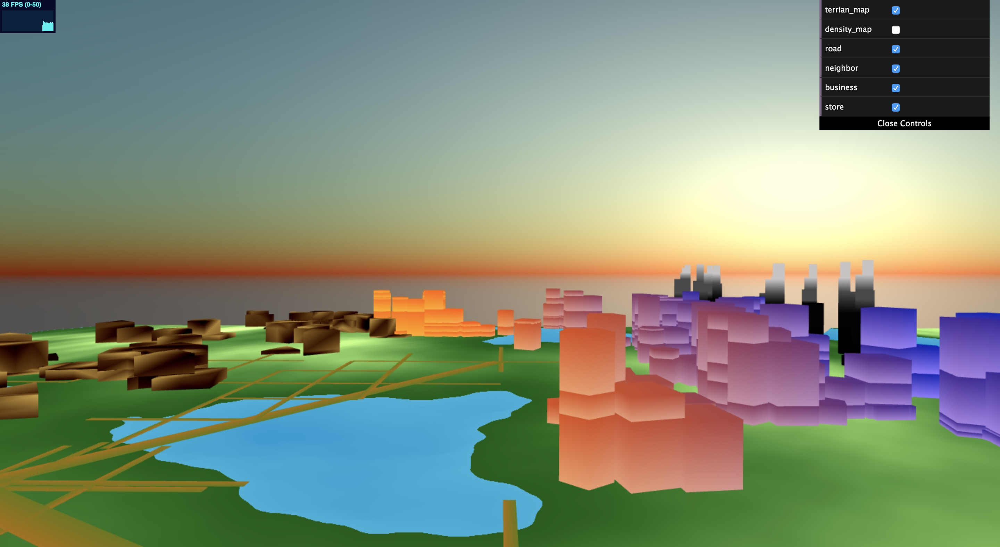
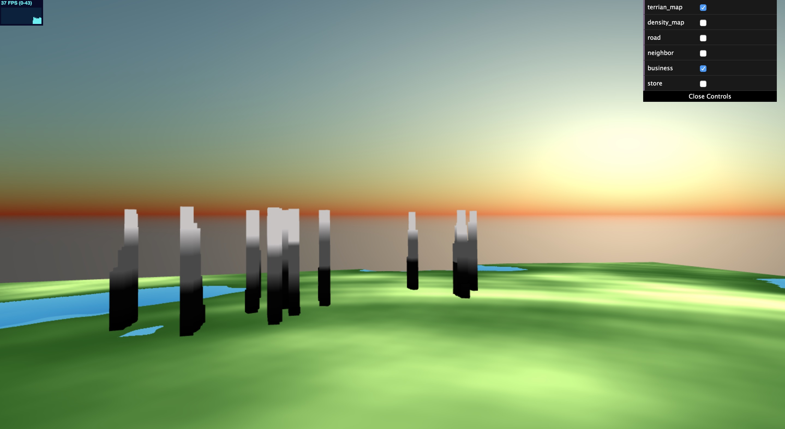
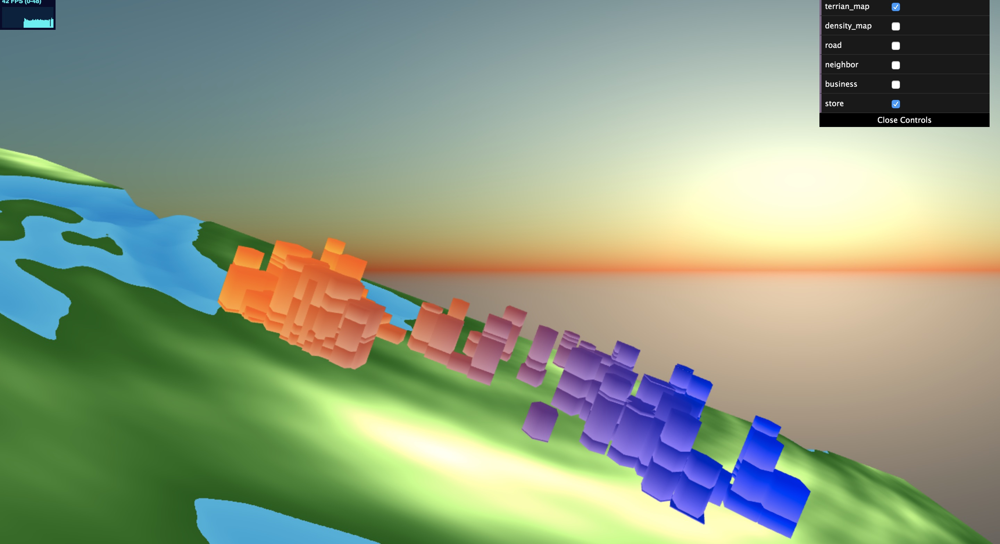
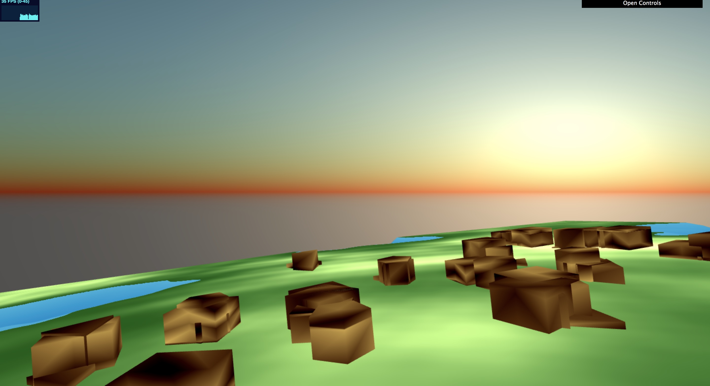

# Homework 6: City Generation

For this assignment, you will generate a collection of 3D buildings within the road networks you created for the previous assignment.

For this assignment, you will generate a network of roads to form the basis of a city using a modified version of L-systems. As in homework 4, you will be using instanced rendering to draw your road networks.

## Student Information
**Name: **Chianti Yan

**Penn ID:** 85100574


## Demo and outputs 

The live demo can be checked under this link: <https://chiantiyzy.github.io/hw06-city-generation/>

At the very beginning you will see a plain terrain, and by clicking on the different options on the control pannel, you will see a full city generated like this: 




## Algorithms

+ **3D Terrain**

  The terrain is generated by a fbm noise function. I make the water area lower than the grass area, and use a mix function to gradually sloping the height of the connecting areas. 

+ **Roads Display**

  The road is drawn basically the same as my HW5. Since the map in CPU and GPU are not matching, the roads will still go in to the water (The L-System is not wrong but just the maps are not matching for some reasons…). I store the terrain in a lambert shader and the roads and citys in  instance shader, and make the roads a little bit higher than the terrain.

+ **2D Grid and Random Scattered Points**

  I do believe that generating a whole 2D grid map is too time-consuming, so I decided to make a revision. The way I do the 'rasterization' is that I first scatter random points on the terrain, and I checked the surrounding 25 pixels of the point to make sure that non of them are intersected with highway, street and water area. 

  + To check the intersection with roads, I using an intersection function I found online to check with every road I stored previously in my road map. The intersection function is in my **main.js** as below:

    ```javascript
    function lies_on_segment(point : vec3, start : vec3, end : vec3)
    ```

  + To check the intersection with water, I simply check the density of the current pixel to see whether the density is 0. If so, then it is in the water. The intersection function is in my **main.js** as below:

    ```javascript
    function lies_on_water(point: vec3)
    ```

  + Not only checking the simple pixel, I checked the 25 pixels surrounded it (which I believe is the bounding box of my buidling), such that I can make sure that the building will not overlap with any forbidden area.  The checking function is in my **main.js** as below:

    ```javascript
    function is_Forbidden(x: number, y: number, draw: Draw) 
    ```

I think this checking method gives the correct result about where to put the building just as the 2D grid, and this one should be faster. 

+ **Building Generation**

  After I decide where to put the building, I check the density of that pixel and decide which building to generate. The basic idea about building generation is to add a new geometry layer by layer and extrude all geometries together until they hit the ground. My algorithm is simply checking the distance from the bottom of the buildling to the ground and keep on adding new geometries when it is not hitting the ground yet. The generation functions are stored in my **Building.js** file.

  There are three types of buildings in my project: *neighbor*, *store*, and *business*.

  + **Business**

    Business buildings lay on the most populated areas. Since they are skyscrapers, I make them tall and thin and more modern, so they can form the skyline together. I also gave them an animated texture because most of the office buildings have glasses walls which always lighting. The business buildings look like below:

    

  + **Store**

    Medium populated buildings are stores. I think stores and shoping malls are always combined by a lot of building, so I make them clustered and compact. Also, I think the stores usually have relatively regular shapes, so I get rid of the prism form for store buildings and only keep cube and pentagon shapes. I also colored them using strips such that the different floors can be easily seen. I want to stores to have a uniform shading so it can be considered as a series of shopping malls. Therefore, I mix the color of the stores based on the x axis. The output looks like below:

    

  + **Neighbor**

    Neighbor buildings are the residential buildings lay on the lowest populated areas. Since they are residential houses, the height is lower but every geometry is big and seperated. I want to distinguish the commerical buidling and the residential ones so I gave these buildings a more sketchy texture. I want them to look like cottages in color and shape. The output is as below:

    

+ **Sky Generation**

  The procedural sky is based on the reference on IQ's website. It is a gradural gradient based on the y axis and the sun is based on the dot product of the y position and the sun direction. 

  

## External References 

- **Intersection Algorithm** 

  <https://gis.stackexchange.com/questions/139033/check-if-a-point-coordinate-is-between-linestring-coordinates>

- **Worley Nosie Function**

  <https://github.com/ashima/webgl-noise/blob/master/src/noise2D.glsl>

- **Procedural Sky**

  <https://www.shadertoy.com/view/lt2SR1>

  
